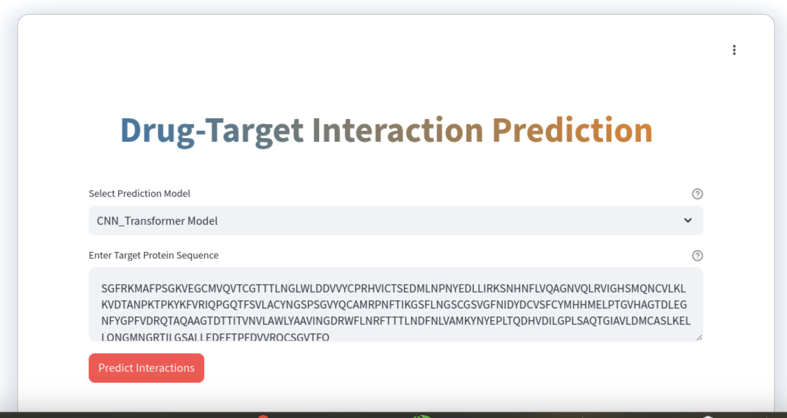
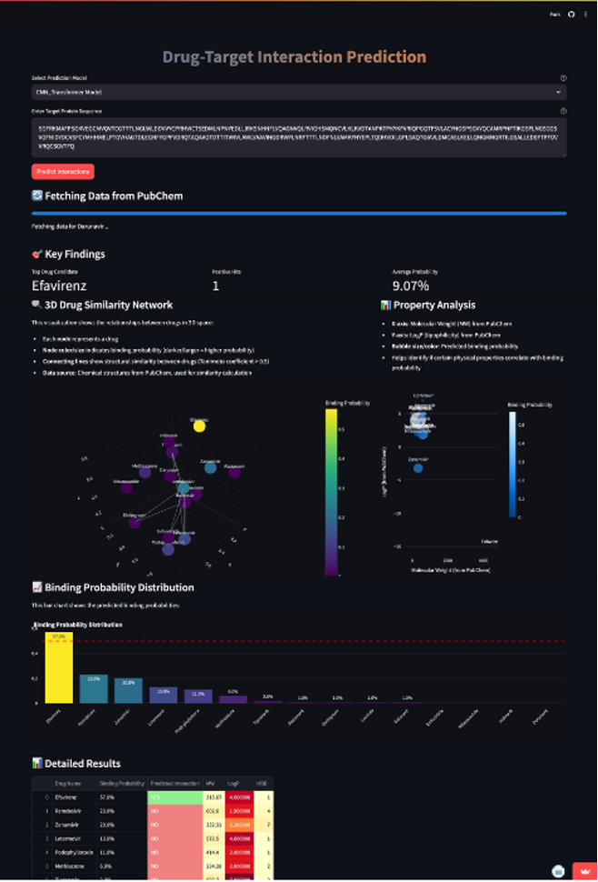
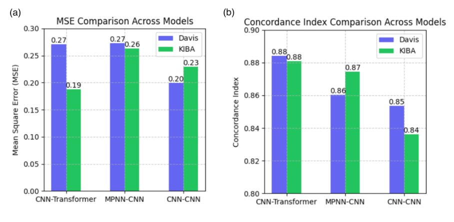
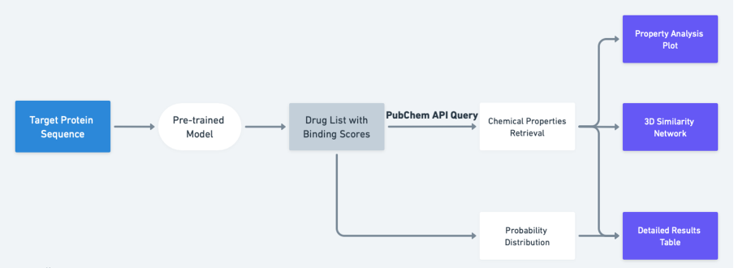

# 🎯 Predictive Modelling of Drug Target Interaction



## 📝 Overview

This project implements an improved deep learning framework for predicting drug-target interactions (DTI), combining multiple encoder architectures including CNN, Transformer, and Message-Passing Neural Networks (MPNN). Our approach utilizes both structural information of compounds through SMILES representation and protein sequences through amino acid encodings.

## ✨ Key Features

- Multiple encoder combinations (CNN, Transformer, MPNN)
- Benchmark evaluation on DAVIS and KIBA datasets
- Case study on SARS-CoV 3C-like protease
- Interactive web interface with PubChem integration

## 🚀 Getting Started

### Prerequisites

- Python 3.8+
- PyTorch
- RDKit
- Streamlit
- Other dependencies (listed in requirements.txt)

### Installation

```bash
git clone https://github.com/yourusername/dti-prediction.git
cd dti-prediction
pip install -r requirements.txt
```

## 💻 Usage

### Training Models

Our models are implemented in Google Colab for easy access and GPU support. 

[](https://colab.research.google.com/your-notebook-link)


### Running Web Interface

```bash
cd web_interface
streamlit run app.py
```




## 📈 Results


Our CNN-Transformer model achieved superior performance with:
- DAVIS dataset: CI of 0.88 and MSE of 0.27
- KIBA dataset: CI of 0.88 and MSE of 0.19




## 🏗️ Project Structure



```
dti-prediction/
│
├── notebooks/          # Colab notebooks for model training
├── web_interface/     # Streamlit web application
├── data/              # Dataset handling and preprocessing
├── models/            # Model architectures
└── utils/            # Helper functions and utilities
```

## 👥 Authors

- Chang Liu
- Yitian Ma
- Yinuo Yang
- Yuning Zheng
- Zhuoqun Li

## 📚 Citation

If you use this code in your research, please cite our work:

```bibtex
@article{liu2024predictive,
  title={Predictive Modelling of Drug Target Interaction},
  author={Liu, Chang and Ma, Yitian and Yang, Yinuo and Zheng, Yuning and Li, Zhuoqun},
  year={2024}
}
```

## 📄 License

This project is licensed under the MIT License - see the [LICENSE](LICENSE) file for details.
